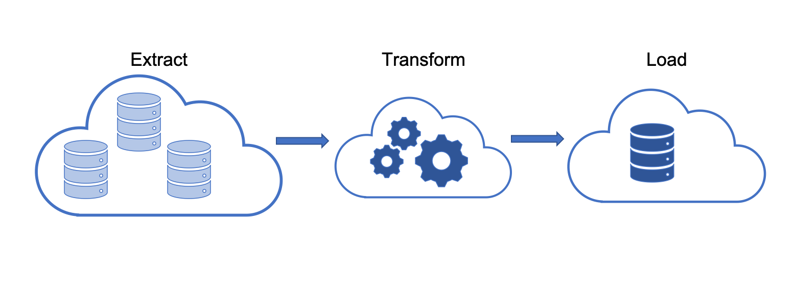

<!-- Other Badgets https://naereen.github.io/badges/ -->
[![Contributors][contributors-shield]][contributors-url]
[![Forks][forks-shield]][forks-url]
[![Stargazers][stars-shield]][stars-url]
[![Issues][issues-shield]][issues-url]
[![LinkedIn][linkedin-shield]][linkedin-url]
<!-- [![License][license-shield]][license-url] -->

<!-- PROJECT LOGO -->
<br />
<p align="center">
  <a href="https://github.com/kevinclee26/big_data_product_reviews">
    
  </a>

  <h3 align="center">big_data_product_reviews</h3>

  <p align="center">
    A demostration of Python + Spark + PostgreSQL for Big Data Amazon Product Reviews Analysis
    <br />
    <a href="https://github.com/kevinclee26/big_data_product_reviews"><strong>Explore the docs »</strong></a>
    <br />
    <br />
    <a href="https://github.com/kevinclee26/big_data_product_reviews">View Demo</a>
    ·
    <a href="https://github.com/kevinclee26/big_data_product_reviews/issues">Report Bug</a>
    ·
    <a href="https://github.com/kevinclee26/big_data_product_reviews/issues">Request Feature</a>
  </p>
</p>

<!-- TABLE OF CONTENTS -->
<details open="open">
  <summary>Table of Contents</summary>
  <ol>
    <li>
      <a href="#about-the-project">About The Project</a>
      <ul>
        <li><a href="#built-with">Built With</a></li>
      </ul>
    </li>
    <li>
      <a href="#getting-started">Getting Started</a>
      <ul>
        <li><a href="#prerequisites">Prerequisites</a></li>
        <li><a href="#installation">Installation</a></li>
      </ul>
    </li>
    <li><a href="#usage">Usage</a></li>
    <li><a href="#roadmap">Roadmap</a></li>
    <li><a href="#contributing">Contributing</a></li>
	<!-- <li><a href="#license">License</a></li> -->
    <li><a href="#contact">Contact</a></li>
    <li><a href="#acknowledgements">Acknowledgements</a></li>
  </ol>
</details>

<!-- ABOUT THE PROJECT -->
## About The Project

[![Product Name Screen Shot][product-screenshot]][product-url]
This projects uses PySpark to analyze 9MM+ product reviews. 
Due to the large amounts of data that is involved, the Apache Spark engine is a requirement for this type of analysis. Furthermore, this type of ETL is well suited for cloud computing such as Google Colab. 
After performing basic data cleaning and data normalization, the data is loaded into an AWS RDS instace. Data normalization reduces redundancy and therefore the size of the data by as much as 30%, although it translates to added compute in the future for data retreival. 

### Built With

<!-- This section should list any major frameworks that you built your project using. Leave any add-ons/plugins for the acknowledgements section. Here are a few examples. -->

* [Python](https://www.python.org/)
* [Apache Spark](https://spark.apache.org/)
* [PostgreSQL](https://www.postgresql.org/)
* [Amazon Web Services (AWS)](https://aws.amazon.com/)

<!-- GETTING STARTED -->
## Getting Started

<!-- This is an example of how you may give instructions on setting up your project locally. To get a local copy up and running follow these simple example steps. -->

The Data is originally sourced from Amazon - check it out [here][product-url]. 
Basic instructions available below to get a local copy up and running. 

### Prerequisites

<!-- This is an example of how to list things you need to use the software and how to install them. -->
* Python
* Google Colab

### Installation

1. Clone the repo
   ```sh
   git clone https://github.com/kevinclee26/big_data_product_reviews.git
   ```
2. Open the .ipynb in Google Colab
3. Google Colab does not come with Spark preloaded therefore to install spark in the Google Colab session use
   ```sh
   import os
   # Find the latest version of spark 3.0  from http://www-us.apache.org/dist/spark/ and enter as the spark version
   # For example:
   spark_version = 'spark-3.0.2'
   os.environ['SPARK_VERSION']=spark_version

   # Install Spark and Java
   !apt-get update
   !apt-get install openjdk-11-jdk-headless -qq > /dev/null
   !wget -q http://www-us.apache.org/dist/spark/$SPARK_VERSION/$SPARK_VERSION-bin-hadoop2.7.tgz
   !tar xf $SPARK_VERSION-bin-hadoop2.7.tgz
   !pip install -q findspark

   # Set Environment Variables
   os.environ["JAVA_HOME"]="/usr/lib/jvm/java-11-openjdk-amd64"
   os.environ["SPARK_HOME"]=f"/content/{spark_version}-bin-hadoop2.7"

   # Start a SparkSession
   import findspark
   findspark.init()
   ```
3. Google Colab also needs a Postgres driver in order to interact with the RDS
   ```sh
   !wget https://jdbc.postgresql.org/download/postgresql-42.2.9.jar
   ```

<!-- USAGE EXAMPLES -->
## Usage

<!-- Use this space to show useful examples of how a project can be used. Additional screenshots, code examples and demos work well in this space. You may also link to more resources. -->
This project demonstrates performing Cloud ETL on a large data set. 

<!-- ROADMAP -->
## Roadmap

See the [open issues](https://github.com/kevinclee26/big_data_product_reviews/issues) for a list of proposed features (and known issues).

<!-- CONTRIBUTING -->
## Contributing

Contributions are what make the open source community such an amazing place to be learn, inspire, and create. Any contributions you make are **greatly appreciated**.

1. Fork the Project
2. Create your Feature Branch (`git checkout -b feature/AmazingFeature`)
3. Commit your Changes (`git commit -m 'Add some AmazingFeature'`)
4. Push to the Branch (`git push origin feature/AmazingFeature`)
5. Open a Pull Request

<!-- LICENSE -->
<!-- ## License

Distributed under the MIT License. See `LICENSE` for more information.
 -->

<!-- CONTACT -->
## Contact

Kevin Lee - [@kevin-c-lee26][linkedin-url] - kevin.c.lee26@gmail.com

Project Link: [https://github.com/kevinclee26/big_data_product_reviews](https://github.com/kevinclee26/big_data_product_reviews)

<!-- ACKNOWLEDGEMENTS -->
## Acknowledgements

* [Img Shields](https://shields.io)
* [Choose an Open Source License](https://choosealicense.com)
* [Amazon](https://www.amazon.com/)

<!-- MARKDOWN LINKS & IMAGES -->
<!-- https://www.markdownguide.org/basic-syntax/#reference-style-links -->
[contributors-shield]: https://img.shields.io/github/contributors/kevinclee26/big_data_product_reviews.svg?style=for-the-badge
[contributors-url]: https://github.com/kevinclee26/big_data_product_reviews/graphs/contributors
[forks-shield]: https://img.shields.io/github/forks/kevinclee26/big_data_product_reviews.svg?style=for-the-badge
[forks-url]: https://github.com/kevinclee26/big_data_product_reviews/network/members
[stars-shield]: https://img.shields.io/github/stars/kevinclee26/big_data_product_reviews.svg?style=for-the-badge
[stars-url]: https://github.com/kevinclee26/big_data_product_reviews/stargazers
[issues-shield]: https://img.shields.io/github/issues/kevinclee26/big_data_product_reviews.svg?style=for-the-badge
[issues-url]: https://github.com/kevinclee26/big_data_product_reviews/issues
<!-- [license-shield]: 
[license-url]:  -->
[linkedin-shield]: https://img.shields.io/badge/-LinkedIn-black.svg?style=for-the-badge&logo=linkedin&colorB=555
[linkedin-url]: https://www.linkedin.com/in/kevin-c-lee26/
[product-screenshot]: https://github.com/kevinclee26/big_data_product_reviews/blob/main/images/schema_size.png?raw=true
[product-url]: https://s3.amazonaws.com/amazon-reviews-pds/tsv/index.txt